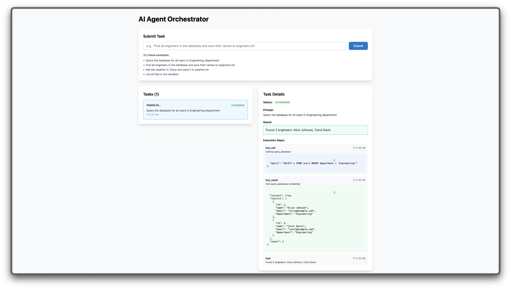

# AI Agent Orchestrator

A demo agent orchestration system showcasing tool calling, sandboxed execution, and real-time monitoring. Built with SvelteKit and TypeScript.


_Real-time agent execution with tool calling and audit trails_

### What This Demonstrates

This is a technical demonstration of AI agent infrastructure, not just a chat UI, but the actual orchestration layer that manages autonomous tool execution.

### Key Capabilities:

- Agent execution engine with LLM-powered decision making
- Tool registry with filesystem, database, and API integrations
- Sandboxed execution with safety guardrails
- Real-time task monitoring with full audit trails
- Error handling, retries, and validation

### Quick Start

```
npm install
```

Add your Groq API key to `.env`:

```
GROQ_API_KEY=your_key_here
```

Get a free key at [console.groq.com](https://console.groq.com)

```
npm run dev
```

### Usage Examples

Try these prompts to see the agent in action:

**Simple Queries:**

```
Query the database for all users in Engineering department
```

**Multi-Step Tasks:**

```
Find all engineers in the database and save their names to engineers.txt
```

**External Data:**

```
Get the weather in Tokyo and save it to weather.txt
```

**File Operations:**

```
List all files in the sandbox
```

### Architecture

`User Request → Agent Orchestrator → Tool Registry → Tool Execution → Results`

- **Agent Orchestrator:** Manages the LLM decision loop, coordinates tools, handles errors
- **Tool Registry:** Validates parameters, enforces timeouts, routes to correct tools
- **Tools:** Sandboxed file ops, database queries (SELECT only), external APIs

### Safety Guardrails

- 30s timeout per tool
- File operations limited to sandbox directory
- Database restricted to SELECT queries
- Full audit trail of all decisions

### Tech Stack

- **Frontend:** SvelteKit, TypeScript, TailwindCSS
- **Backend:** SvelteKit API routes, Node.js
- **LLM Provider:** Groq
- **Database:** SQLite (better-sqlite3)
- **File System:** Node.js fs/promises

### Known Limitations

#### LLM Behavior:

- Free-tier Groq API can be occasionally flaky with tool calling
- Agent may sometimes attempt extra "helpful" actions not explicitly requested
- For production use, consider Claude API or GPT-4 for better instruction adherence

#### Current Scope:

- Single-user demo (no authentication)
- In-memory task storage (resets on restart)
- Limited to pre-defined tools
- No multi-agent coordination

#### Security Note:

This is a demo with intentionally simplified security:

- Database queries use keyword blocking (production would use parameterized queries)
- No URL validation for external APIs
- No rate limiting
- No authentication

**For production:** Add parameterized queries, URL whitelisting, rate limiting, and authentication.
